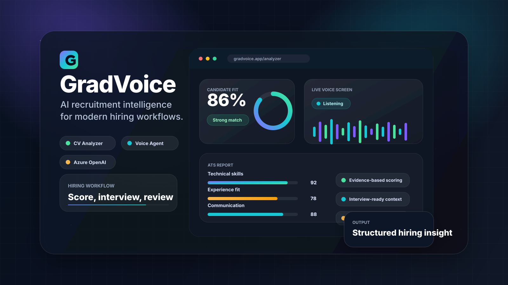
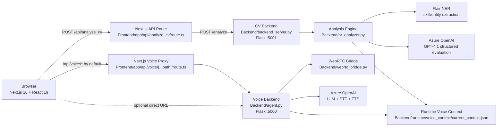

# GradVoice

AI-powered recruitment intelligence for CV screening, job-fit scoring, and live voice interviews.


<p align="center">
  
</p>

## Overview

GradVoice is a full-stack AI recruitment platform that helps hiring teams evaluate candidates from two angles:

- **CV Analyzer**: compares a candidate CV against a job description, extracts evidence, scores the match across eight hiring dimensions, and generates an ATS-style report.
- **Voice Agent**: runs a live AI-guided screening interview after a CV analysis is complete, captures the conversation through WebRTC, and produces recruiter-facing transcript insights.

The application combines a Next.js frontend with two Flask services backed by Azure OpenAI. The CV analysis backend performs document extraction, skill/entity matching, and structured LLM evaluation. The voice backend provides real-time interview flow, speech-to-text, text-to-speech, and optional candidate-specific context from the latest analysis.

## Table of Contents

- [Features](#features)
- [Architecture](#architecture)
- [Tech Stack](#tech-stack)
- [Repository Structure](#repository-structure)
- [Getting Started](#getting-started)
- [Environment Variables](#environment-variables)
- [API Reference](#api-reference)
- [Data Flow](#data-flow)
- [Deployment Notes](#deployment-notes)
- [Troubleshooting](#troubleshooting)

## Features

### CV Analyzer

- Upload a candidate CV as PDF, DOCX, TXT, or ZIP batch.
- Use a built-in library of **134 curated job descriptions** across AI, software engineering, data, cloud, security, fintech, design, QA, robotics, and more.
- Upload a custom job description when the built-in role library is not enough.
- Extract skills and entities with Flair NER plus curated technical, soft-skill, and domain dictionaries.
- Generate structured Azure OpenAI evaluation output with:
  - final match score
  - classification and readiness label
  - eight-dimension score breakdown
  - matched skills with evidence
  - missing skills and grouped gaps
  - candidate advice, interview tips, and learning recommendations
- Export analysis results to PDF from the frontend dashboard.
- Persist the latest analysis in browser storage under `gradvoice_analysis_v1`.

### Batch Screening

- Upload a ZIP of candidate CVs through the same analyzer flow.
- Process each supported file against one job description.
- Return summarized candidate rows with scores, classifications, and errors.
- Control maximum batch size with `MAX_BATCH_CVS` on the CV backend.

### Voice Agent

- Unlocks only after a valid CV analysis is complete.
- Uses WebRTC for microphone capture and live backend-driven audio flow.
- Sends interview events over a data channel for transcript and AI state updates.
- Supports interruption through `/webrtc/session/:id/interrupt`.
- Uses Azure GPT-4.1 for interview reasoning, GPT-4o Transcribe for speech-to-text, and GPT-4o mini TTS for spoken responses.
- Loads candidate/job context from `Backend/runtime/voice_context/current_context.json`, generated automatically by the CV analyzer.
- Produces transcript, communication signals, topic detection, recruiter notes, and post-session summary.

## Architecture



### Runtime Services

| Service | Default URL | Purpose |
| --- | --- | --- |
| Next.js frontend | `http://localhost:3000` | Product UI, analyzer, voice workspace, API proxy routes |
| CV backend | `http://127.0.0.1:5001` | CV/JD upload handling and analysis orchestration |
| Voice backend | `http://127.0.0.1:5000` | WebRTC voice sessions, STT, TTS, and interview reasoning |

## Tech Stack

| Layer | Technologies |
| --- | --- |
| Frontend | Next.js 16, React 19, TypeScript, Tailwind CSS, Radix UI, shadcn/ui, lucide-react |
| CV backend | Python, Flask, Flask-CORS, pdfplumber, python-docx, Flair NER, Azure OpenAI |
| Voice backend | Python, Flask, aiortc, av, NumPy, Azure OpenAI, Azure GPT-4o Transcribe, Azure GPT-4o mini TTS |
| Persistence | Browser `localStorage`, backend runtime JSON context, temporary upload directories |
| Export | jsPDF |

## Repository Structure

```text
HR-ADVISOR_full-master/
+-- Backend/
|   +-- agent.py                     # Voice agent Flask server
|   +-- backend_server.py            # CV analysis Flask server
|   +-- hr_analyzer.py               # CV/JD extraction, scoring, and LLM evaluation
|   +-- webrtc_bridge.py             # WebRTC session bridge for voice interviews
|   +-- requirements-voice.txt       # Voice backend Python dependencies
|   +-- runtime/
|   |   +-- voice_context/
|   |       +-- current_context.json # Latest analysis context for the voice agent
|   +-- uploads/                     # Runtime uploads and temporary analysis files
|
+-- Frontend/
|   +-- app/
|   |   +-- analyzer/                # CV analyzer route
|   |   +-- voice-agent/             # Voice agent route
|   |   +-- api/
|   |       +-- analyze_cv/          # Next.js proxy to the CV backend
|   |       +-- voice/[...path]/     # Next.js proxy to the voice backend
|   +-- components/
|   |   +-- cv-analyzer.tsx          # Upload workspace and analyzer workflow
|   |   +-- ats-dashboard.tsx        # ATS-style result dashboard
|   |   +-- nav-bar.tsx              # Navigation and voice access gate
|   |   +-- ui/                      # Shared UI primitives
|   +-- context/
|   |   +-- analysis-context.tsx     # Analysis state and localStorage persistence
|   +-- lib/
|   |   +-- http-client.ts           # WebRTC voice client
|   +-- public/
|   |   +-- jds/                     # 134 static job description PDFs
|   +-- package.json
|
+-- docs/                            # Project planning and implementation notes
```

## Getting Started

### Prerequisites

- Node.js 20+ recommended
- Python 3.10+
- Azure OpenAI resource with deployments for:
  - GPT-4.1 or compatible chat model
  - GPT-4o Transcribe or compatible transcription deployment
  - GPT-4o mini TTS or compatible speech deployment
- Chrome or Edge for voice sessions

> Voice capture requires microphone permissions. In production, browsers require HTTPS for microphone/WebRTC access.

### 1. Clone and Install Frontend Dependencies

```bash
cd Frontend
npm ci
```

### 2. Configure Frontend Environment

Create `Frontend/.env.local`:

```env
# Server-side proxy used by /api/analyze_cv
CV_ANALYZE_BACKEND_URL=http://127.0.0.1:5001/analyze
CV_ANALYZE_BACKEND_TIMEOUT_MS=1800000

# Server-side proxy used by /api/voice/*
VOICE_BACKEND_URL=http://127.0.0.1:5000

# Optional. Leave unset to use the Next.js /api/voice proxy.
# NEXT_PUBLIC_VOICE_SERVER_URL=http://127.0.0.1:5000

NEXT_PUBLIC_ENABLE_VERCEL_ANALYTICS=false
```

### 3. Configure Backend Environment

Create `Backend/.env`:

```env
# CV analysis backend
HR_AZURE_OPENAI_API_KEY=your_key
HR_AZURE_OPENAI_ENDPOINT=https://your-resource.openai.azure.com/
HR_AZURE_OPENAI_DEPLOYMENT=gpt-4.1
HR_AZURE_OPENAI_API_VERSION=2024-12-01-preview
MAX_BATCH_CVS=25

# Voice agent LLM
AZURE_OPENAI_API_KEY=your_key
AZURE_OPENAI_ENDPOINT=https://your-resource.openai.azure.com/
AZURE_OPENAI_DEPLOYMENT=gpt-4.1
AZURE_OPENAI_API_VERSION=2025-01-01-preview

# Voice transcription
AZURE_TRANSCRIBE_API_KEY=your_key
AZURE_TRANSCRIBE_ENDPOINT=https://your-resource.openai.azure.com/
AZURE_TRANSCRIBE_DEPLOYMENT=gpt-4o-transcribe
AZURE_TRANSCRIBE_API_VERSION=2025-03-01-preview
AZURE_TRANSCRIBE_LANGUAGE=en
AZURE_TRANSCRIBE_PROMPT=The speaker is speaking English.

# Voice synthesis
AZURE_TTS_API_KEY=your_key
AZURE_TTS_ENDPOINT=https://your-resource.openai.azure.com/
AZURE_TTS_DEPLOYMENT=gpt-4o-mini-tts
AZURE_TTS_API_VERSION=2025-03-01-preview
AZURE_TTS_VOICE=alloy

# Voice backend server
SERVER_HOST=0.0.0.0
SERVER_PORT=5000
DEBUG=true

# Optional context overrides
# VOICE_CONTEXT_JSON=Backend/runtime/voice_context/current_context.json
# VOICE_CONTEXT_PDFS=path/to/cv.pdf,path/to/job-description.pdf
# VOICE_CONTEXT_PDF_MAX_CHARS=12000
# VOICE_CONTEXT_MAX_CHARS=30000
```

The CV analyzer also falls back to `AZURE_OPENAI_*` values when `HR_AZURE_OPENAI_*` values are not set.

### 4. Start the CV Analysis Backend

In a terminal:

```bash
cd Backend
python -m venv .venv

# Windows PowerShell
.\.venv\Scripts\Activate.ps1

# macOS/Linux
# source .venv/bin/activate

pip install flask flask-cors python-dotenv werkzeug pdfplumber python-docx flair openai
python backend_server.py
```

The CV backend starts on `http://127.0.0.1:5001`.

### 5. Start the Voice Backend

In a second terminal:

```bash
cd Backend

# Activate the same virtual environment if you created one
# Windows PowerShell:
.\.venv\Scripts\Activate.ps1
# macOS/Linux:
# source .venv/bin/activate

pip install -r requirements-voice.txt
python agent.py
```

The voice backend starts on `http://127.0.0.1:5000`.

If you plan to load additional PDF context through `VOICE_CONTEXT_PDFS`, install the optional `pypdf` package in the backend environment.

### 6. Start the Frontend

In a third terminal:

```bash
cd Frontend
npm run dev
```

Open `http://localhost:3000`.

For HTTPS local development:

```bash
npm run dev:https
```

## Environment Variables

### Backend

| Variable | Required | Used by | Description |
| --- | --- | --- | --- |
| `HR_AZURE_OPENAI_API_KEY` | Yes for CV | `hr_analyzer.py` | Azure OpenAI key for CV analysis |
| `HR_AZURE_OPENAI_ENDPOINT` | Yes for CV | `hr_analyzer.py` | Azure OpenAI endpoint for CV analysis |
| `HR_AZURE_OPENAI_DEPLOYMENT` | No | `hr_analyzer.py` | Chat deployment, defaults to `gpt-4.1` |
| `HR_AZURE_OPENAI_API_VERSION` | No | `hr_analyzer.py` | API version, defaults to `2024-12-01-preview` |
| `MAX_BATCH_CVS` | No | `backend_server.py` | Maximum supported CVs in a ZIP batch, defaults to `25` |
| `AZURE_OPENAI_API_KEY` | Yes for voice | `agent.py` | Azure OpenAI key for interview reasoning |
| `AZURE_OPENAI_ENDPOINT` | Yes for voice | `agent.py` | Azure OpenAI endpoint for interview reasoning |
| `AZURE_OPENAI_DEPLOYMENT` | No | `agent.py` | Chat deployment, defaults to `gpt-4.1` |
| `AZURE_TRANSCRIBE_API_KEY` | Yes for STT | `agent.py` | Azure transcription key. Falls back to `AZURE_OPENAI_API_KEY` |
| `AZURE_TRANSCRIBE_ENDPOINT` | Yes for STT | `agent.py` | Azure transcription endpoint |
| `AZURE_TRANSCRIBE_DEPLOYMENT` | No | `agent.py` | Defaults to `gpt-4o-transcribe` |
| `AZURE_TTS_API_KEY` | Yes for TTS | `agent.py` | Azure TTS key. Falls back to `AZURE_OPENAI_API_KEY` |
| `AZURE_TTS_ENDPOINT` | Yes for TTS | `agent.py` | Azure TTS endpoint |
| `AZURE_TTS_DEPLOYMENT` | No | `agent.py` | Defaults to `gpt-4o-mini-tts` |
| `AZURE_TTS_VOICE` | No | `agent.py` | TTS voice, defaults to `alloy` |
| `SERVER_HOST` | No | `agent.py` | Voice backend host, defaults to `0.0.0.0` |
| `SERVER_PORT` | No | `agent.py` | Voice backend port, defaults to `5000` |
| `VOICE_CONTEXT_JSON` | No | `agent.py` | Runtime JSON context path |
| `VOICE_CONTEXT_PDFS` | No | `agent.py` | Optional comma-separated PDF context paths |

### Frontend

| Variable | Required | Description |
| --- | --- | --- |
| `CV_ANALYZE_BACKEND_URL` | No | CV backend target for `/api/analyze_cv`. Defaults to `http://127.0.0.1:5001/analyze` |
| `CV_ANALYZE_BACKEND_TIMEOUT_MS` | No | Timeout for long CV analysis requests. Defaults to 30 minutes |
| `VOICE_BACKEND_URL` | No | Voice backend target for `/api/voice/*`. Defaults to `http://127.0.0.1:5000` |
| `NEXT_PUBLIC_VOICE_SERVER_URL` | No | Direct browser-facing voice URL. If unset, the app uses `/api/voice` |
| `NEXT_PUBLIC_ENABLE_VERCEL_ANALYTICS` | No | Enables Vercel Analytics when set to `true` |

## API Reference

### CV Analysis Backend

`POST /analyze`

```http
Content-Type: multipart/form-data
```

| Field | Type | Description |
| --- | --- | --- |
| `cv_file` | File | Candidate CV as PDF, DOCX, TXT, or ZIP |
| `jd_file` | File | Job description as PDF, DOCX, or TXT |

Single-candidate responses return the complete analysis object from `hr_analyzer.py`. ZIP uploads return a batch wrapper:

```json
{
  "batch": true,
  "job_description": "Software_Engineer_Job_Description.pdf",
  "archive": "candidates.zip",
  "total": 5,
  "processed": 5,
  "skipped_files": [],
  "results": []
}
```

### Next.js CV Proxy

`POST /api/analyze_cv`

The frontend sends analyzer requests here. The route forwards the multipart payload to `CV_ANALYZE_BACKEND_URL`, normalizes connection errors, and returns either a single analysis object or a batch response.

### Voice Backend

| Method | Endpoint | Purpose |
| --- | --- | --- |
| `GET` | `/health` | Readiness check. Returns `200` when Azure config is complete, `503` otherwise |
| `GET` | `/status` | Runtime status, deployment names, context size, and WebRTC availability |
| `POST` | `/context/json` | Push runtime JSON context into the voice context file |
| `POST` | `/webrtc/connect` | Create a WebRTC session from a browser SDP offer |
| `POST` | `/webrtc/session/<session_id>/interrupt` | Interrupt an active WebRTC session |
| `POST` | `/webrtc/session/<session_id>/close` | Close an active WebRTC session |
| `GET` | `/webrtc/session/<session_id>/status` | Inspect an active WebRTC session |
| `POST` | `/chat` | Legacy text/audio request path for `text_input` or `audio_base64` |
| `POST` | `/transcribe` | Speech-to-text utility endpoint |
| `POST` | `/synthesize` | Generate a spoken AI response from text |
| `GET` | `/speaking_status` | Legacy speaking/barge-in status endpoint |
| `POST` | `/interrupt` | Legacy interruption endpoint |

### Next.js Voice Proxy

`/api/voice/*`

The frontend uses this proxy by default. Set `VOICE_BACKEND_URL` on the Next.js server to point the proxy to the Flask voice backend.

## Data Flow

### CV Analysis

1. The user uploads a CV and selects or uploads a job description.
2. The frontend posts both files to `/api/analyze_cv`.
3. The Next.js route forwards the request to `Backend/backend_server.py`.
4. The backend saves the files under `Backend/uploads/`.
5. `hr_analyzer.py` extracts text, identifies skills/entities, and sends a structured scoring prompt to Azure OpenAI.
6. The normalized result is returned to the frontend and saved in `localStorage`.
7. The same result is also written to `Backend/runtime/voice_context/current_context.json` for the voice agent.

### Voice Interview

1. The voice page checks that a valid CV analysis exists.
2. The browser creates a WebRTC offer and sends it to `/api/voice/webrtc/connect`.
3. The Next.js proxy forwards the request to `Backend/agent.py`.
4. The voice backend creates a WebRTC session through `webrtc_bridge.py`.
5. Candidate speech is transcribed, sent through the Azure OpenAI interview agent, synthesized to speech, and streamed back to the browser.
6. Transcript entries and AI state updates are emitted to the frontend over the WebRTC data channel.

## Deployment Notes

- Keep all Azure credentials in environment variables. Do not commit `.env` or `.env.local`.
- Use HTTPS for any deployed voice experience. Browser microphone and WebRTC APIs require secure contexts outside localhost.
- Prefer the `/api/voice` proxy in production to avoid exposing backend internals directly to the browser.
- Restrict Flask CORS origins before production deployment. The current development configuration is permissive.
- Treat uploaded CVs and generated analysis JSON as sensitive candidate data.
- Rotate or clean `Backend/uploads/` and `Backend/runtime/voice_context/` in production environments.
- The Flair NER model loads at CV backend startup and can take time on the first run.

## Troubleshooting

| Problem | Check |
| --- | --- |
| Analyzer says backend is unavailable | Confirm `python backend_server.py` is running on port `5001` and `CV_ANALYZE_BACKEND_URL` is correct |
| Voice page cannot connect | Confirm `python agent.py` is running on port `5000` and `GET http://127.0.0.1:5000/health` returns `200` |
| `/health` returns `503` | One or more Azure keys, endpoints, or deployments are missing |
| Browser blocks microphone | Use Chrome or Edge, allow microphone access, and use HTTPS outside localhost |
| WebRTC connection fails | Install `aiortc` and `av`, check firewall/VPN settings, and verify `VOICE_BACKEND_URL` |
| First CV analysis is slow | Flair is downloading or loading `flair/ner-english-large` |
| Voice answers are not candidate-specific | Run a CV analysis first and confirm `Backend/runtime/voice_context/current_context.json` was updated |

## Project Status

GradVoice is a graduation project prototype built as a complete end-to-end recruitment workflow. It is suitable for demos, local evaluation, and further product hardening around authentication, data retention, access control, audit logging, and production deployment.
